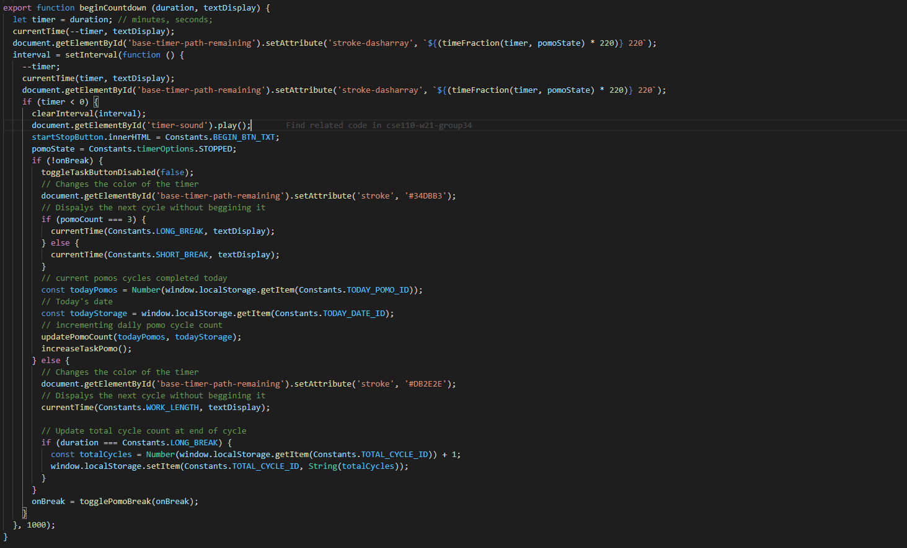
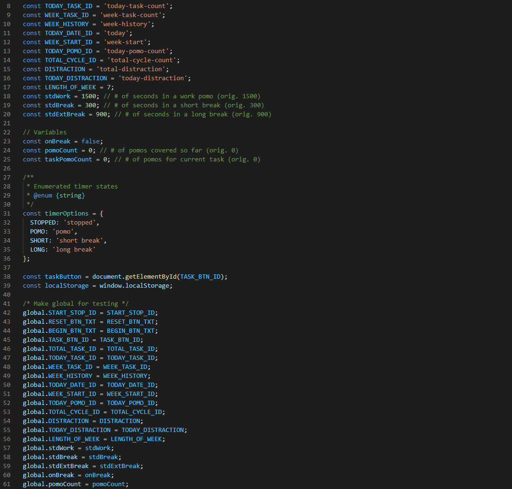
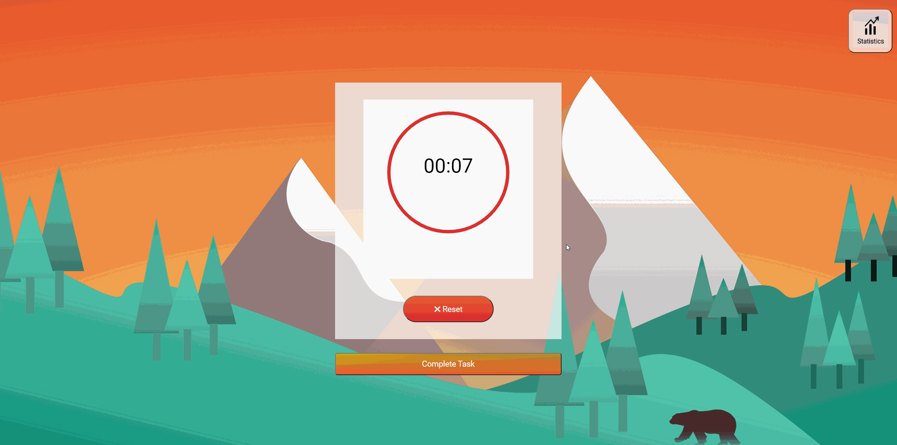

- Team: Teddy Bears
- Date: 3/7/21
- Time: 9:00pm (Sunday)
- Duration: 30 min.
- Location: Zoom (Online)
- Written by: Michael Brown
- Attendance: 9/9

-------

# A Brief Introduction

After the conclusion of Sprint 2, our team had successfully developed an MVP (Minimum Viable Product). The skeleton code of our HTML, CSS, and JS files were established and  populated with functional components. These implementations included a functioning timer, start/stop button, animated UI, and more. Our project's steady progression was heavily influenced by the ways in which we organized ourselves into sub-groups to tackle specific challenges. This success was also attributed by everyone's timely dedication (whether in-person via Zoom or asynchronously across Slack and GitHub).

This level of effort continued into Weeks 8 and 9 for our third Sprint of the quarter. With the MVP out of the way, much of our focus was dedicated to the extensive reorganization and overall improvement of our code. Our previous PRs had left some bugs that were inevitably squashed while testing became more prevelant across future implementations. These improvements created a safer foundation for our members to develop more advanced features. Our sub-groups from Sprint 2 were kept the same to maintain our members' familiarity with the components they had created.

The sections below entails the unique contributions of our members as well as the groups they worked with.

-------

# Team Contributions

### Statistics
- Contributors: **Joshua Narezo, Michael Khanzadeh, Vedparkash Singh**

Main points:
- phases of stats development (back-end localStorage/data retrieval, front-end display population and graphical appearances)

-------

### Pomodoro Counter + localStorage
- Contributor: **Amy Shen**

It's without a doubt that our stats display depends on specific data to read from and calculate. Hence, Amy's work was crucial as her implementations provided a pomodoro counter that tracks user behavior. This feature was first augmented to the timer team's earliest iteration of "beginCountdown", a function that updates the visual timer live depending on user input. Behind the scenes, this function utilizes a variable that tracks the current stages of a pomo cycle to verify when a long or short break should be entered. Amy's feature traces this information and feeds it into localStorage for the functions by our stats team to retrieve.

In addition, this information is displayed on-screen and below the start/stop button (below is a GIF that demonstrates this). There are two unique trackers: the first displays the number of work periods passed until the user presses "Complete Task" whereas the second displays the current stage of the entire pomo cycle. The first counter resets by user input and the second resets once the user finishes their extended break (after 4 work periods).

As the timer team remodeled their code and created newer PRs, Amy was quick to assess any sudden bugs and glitches that would appear in the counters. Her immediate fixtures helped solidify our code and allowed our team to progress more confidently towards future stretch stories.

- *Live example (take note that timer settings are shortened for the sake of showcasing)*

- *Glimpse of implementation*

-------

### Task Button
- Contributors: **Viren Abhyankar, William Sun**

-------

### Timer
- Contributors: **Keshab Agarwal, Michael Brown**

Due to a high number of PRs at the end of Sprint 2, a collision in our code was seemingly inevitable. Thankfully, the timer team responded quickly and resolved a UI glitch in the center of our clock due to a mistakenly deleted portion of CSS code. In addition to this and other design tweaks, Michael B. and Keshab collaborated to resolve several more bugs. These optimizations resided in our JS files, such as updating the interval of our timer countdown function to respond to user input immediatly rather than via 1-second intervals. Another improvement involved simplifying the timer JS functionality from two separate functions (a timer and break counter) into a single function with proper conditionals.

Following Arsen's introduction of Cypress testing to the group project, Michael and Keshab created a new file to increase code coverage. This testing file overlooked the functionality of our start/stop button, proper text display, pomo cycle tracker, and more.

Near the end of the sprint, the Timer Team engaged with new stretch goal features as some of the images below entail a WIP settings pane. Michael utilized the HTML and CSS code written by the statistics team (Joshua, Vedparkash, Michael K.) to clone a left-hand page whereas Keshab's goal will be to help populate its inner panes.

- *Example of written Cypress testing:*

- *Early WIP build of left pane:*

-------

### Code Cleanup + Accessibility
- Contributor: **Arsen Ohanyan**

As a technical project grows, so too does its level of complexity. Arsen took upon the challenge to delve into our MVP from Sprint 2 and reorganize our work before the rest of our teams commenced. This rehaul took place in our JS code as most of our original implementations were within a single file. Arsen thus divided our work into separate files based on our sub-groups (ie. startResetButton.js, stats.js, and taskButton.js). Additionally, a JS file called constants.js was implemented to divide "read-only" constants from "writable" variables. This action was necessary to "internationalize" our variable usage across all other files to enable easier access, readability, and testing.

Arsen then created a lint action for our GitHub repository. Whenever a team would create a PR for our main branch, linting would run to check for and flag any bugs or stylistic errors. This was especially necessary for encouraging our team members' writing styles to "normalize" over time so that individuals could review each other's code more clearly.

As we neared the end of this sprint, Arsen focused on accessibility stretch goals. Colorblindness and keystroke accessibility, as of now, stand as the two current features that are being implemmented. An image below features a snapshot of this WIP.

- *Glimpse of code-cleanup*

- *Example of visual tweak for accessibility:*

Original Appearance        |  Color Brightness/Modification
:-------------------------:|:-------------------------:
  |  

-------

# Demo Overview (w/ Sprint 2 MVP Comparison)
- Take note that the timer durations in both GIFs are shortened for simplified demonstration.

## Before:

## After:

**Viren**
- Configure task button disable
- Completing task button with William
- Local storage function back-end completion
- Improving readability of code for simplistic testing
- Completing prompt to user for tracking interuption

- Future: go over testing; make sure nothing is a "dummy test"

-------

**Michael K.**
- Collaborating with Josh and Ved
- Completing the Graph implementation
  - Formatting the graph; cleaner UI appearance
- Splitting data via x/y axis labels; implmeneting spacing, organization, etc.

- Wrote axis formula for scaling
  - Writing out necessary functions

- Next: implementing storage graph to update automatically
- Creating more Jest/Cypress tests with group for complete coverage

-- Fit in image of graph overview with group here --

-------

**Josh**
- Exploring new visual improvements (for higher-res monitors)
- Collaborating with Michael K. and Ved
- Lots of progress in live mob session

- Planning; created Figma design for graph
  - ie. axes, behavior, organization
  - Sketching module to divide work simultaneously

- Completed drawing for the bars + x-axis labels
- Experimenting with pixel scaling for consistent transformation of app UI

Future: Working to figure out / complete further CSS responsiveness

-------
**Ved**
- Collaboration with Michael K. and Josh
- Setup for extraction of data in back-end
- Animations and visuals (in Week 8)

- Week 9 --> applying everything to final website (making PRs)
  - Connecting the JS to the HTML

- Focusing on the testing side of the group completion
- Completing daily stats with Michael K.

-------

**William**
- Breaking down large local storage function with Viren (week 8)
- Creating more tests in local storage and writing out

- Smooth week progression 

(screenshot of the local storage and (

